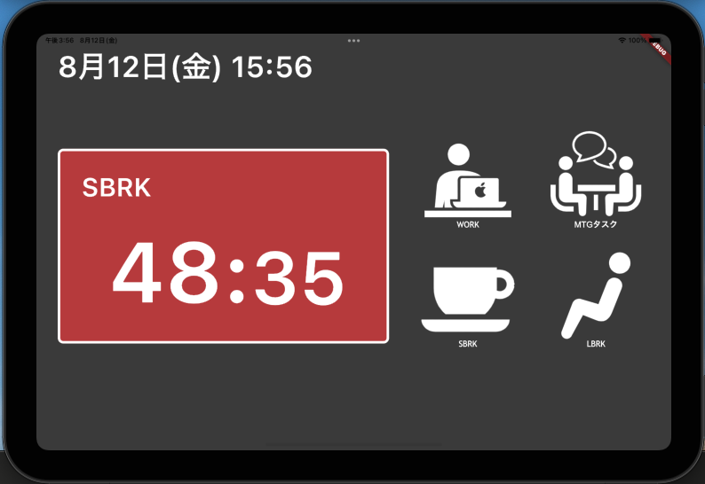

# Pomodoro iOS App
「[pomodoro-linebot](https://github.com/konan0802/pomodoro-linebot)」をGUI上で操作できる様にするためにiOSアプリ化

## 機能
* アプリから下記の”状態”の設定が可能で、その残り時間が確認できる
* 残り時間が0になると、`LINE Bot`に通知が届き、”状態”が`PEND`になる
* 各”状態”における履歴は`Toggl`で確認することが可能
* （未実装）設定画面で`WORK`, `SBRK`, `LBRK`の時間を変更可能

### ◇ 状態
| 状態   | 説明    | 残り時間（デフォルト） |
| -     | -       | -                  |
| WORK  | 仕事中   | 40分後              |
| SBRK  | 短い休憩 | 5分後               |
| LBRK  | 長い休憩 | 10分後              |
| MTG   | 会議     | 30分後             |
| LUNCH | 昼食     | 60分後             |

## 技術スタック
| 技術領域      | 利用技術               | 
| -            | -                    | 
| FE           | Flutter              |
| Notification | LINE Bot             |
| Time Tracker | Toggl                |
